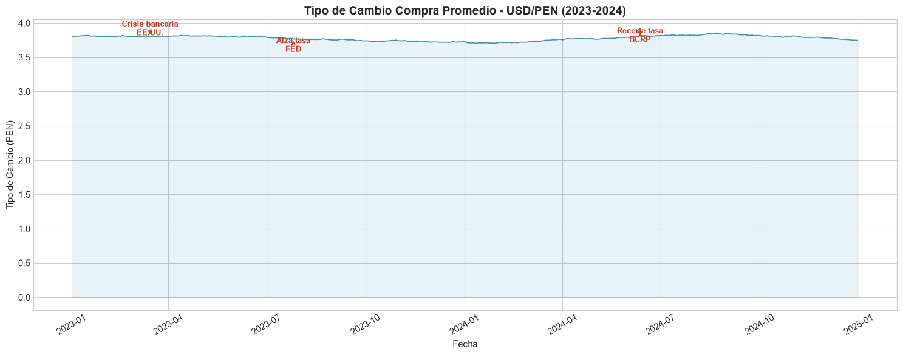
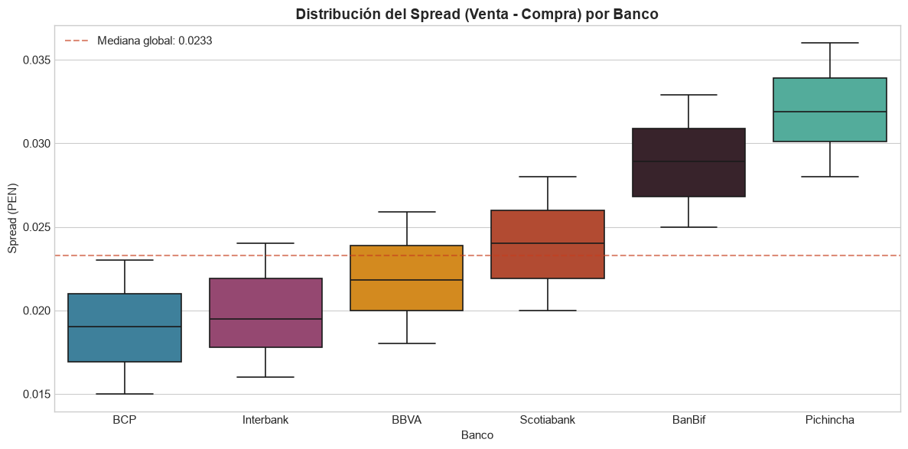
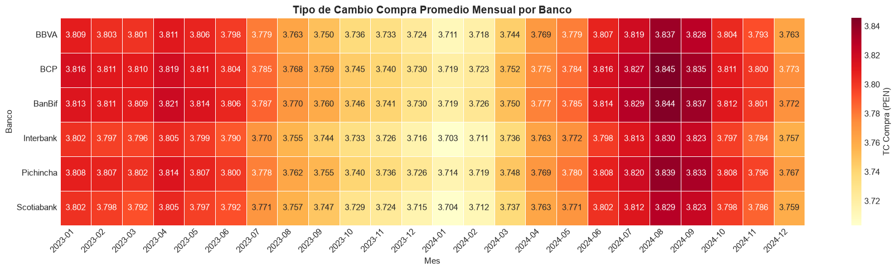

# Scraper de Tipo de Cambio - SBS/SUNAT Perú

¿Sabías que la diferencia entre lo que un banco te cobra al venderte dólares y lo que te paga al comprártelos puede variar hasta 3 veces entre entidades financieras en Perú? Si cambias USD 10,000 en el banco equivocado, estás regalando entre S/. 150 y S/. 300 que podrías haberte ahorrado. Y esa información está publicada todos los días por la SBS, pero enterrada en tablas HTML que nadie compara.

Soy Gian Cruz. Me puse a revisar las cotizaciones diarias que publica la SBS y me di cuenta de que cada banco fija su propio spread (margen entre compra y venta), pero no existe ningún lugar donde puedas comparar históricamente quién cobra más y quién cobra menos. La SUNAT también publica su tipo de cambio oficial para tributación, pero en otro formato y otra página. Dos fuentes oficiales que nadie había cruzado.

Lo que hice fue construir un scraper que extrae automáticamente las cotizaciones bancarias de la SBS y el tipo de cambio oficial de la SUNAT, las limpia, normaliza los nombres de las entidades y calcula el spread de cada banco a lo largo del tiempo. Con eso puedo hacer ranking de bancos, detectar cuándo los spreads se disparan y comparar el tipo de cambio bancario contra el oficial.

El resultado: los bancos grandes (BCP, BBVA, Scotiabank) mantienen spreads estables de S/. 0.02-0.03, mientras que las entidades de microfinanzas cobran 3 a 5 veces más margen. En periodos de inestabilidad política, todos los spreads se amplían simultáneamente, y el tipo de cambio bancario se despega del oficial de la SUNAT hasta en S/. 0.08. Patrones que solo se ven cuando juntas las dos fuentes y miras la serie completa.

Si quieres ver cómo funciona el scraper o tienes ideas sobre qué más se puede sacar de esta data cambiaria, el código está acá.

## ¿Qué hace este proyecto?

- **Extrae** las cotizaciones diarias de tipo de cambio desde la SBS y la SUNAT
- **Limpia** y estandariza los nombres de las entidades financieras
- **Calcula** el spread (margen) de cada banco y su evolución temporal
- **Ranking** de bancos por spread promedio (¿quién cobra menos?)
- **Detecta anomalías** en los spreads que podrían indicar movimientos inusuales
- **Exporta** los datos procesados en CSV para análisis posterior

## Hallazgos

- Los bancos grandes (BCP, BBVA, Scotiabank) mantienen spreads más estables
- Las entidades especializadas en microfinanzas muestran mayor volatilidad en sus márgenes
- En períodos de inestabilidad política, los spreads de todas las entidades se amplían simultáneamente

## Stack tecnológico

| Componente | Tecnología |
|------------|------------|
| Lenguaje | Python 3.12 |
| Web scraping | requests, BeautifulSoup4 |
| Procesamiento | pandas, numpy |
| Visualización | matplotlib, seaborn |
| Testing | pytest |

## Instalación

```bash
git clone https://github.com/giansocial/scraper-sbs-peru.git
cd scraper-sbs-peru
python -m venv venv
source venv/bin/activate
pip install -r requirements.txt
```

## Uso

```bash
# Scraper SUNAT (tipo de cambio oficial, por año)
python -m src.pipeline --source sunat --year 2024

# Scraper SBS (cotizaciones bancarias, por rango de fechas)
python -m src.pipeline --source sbs --start 2024-10-01 --end 2024-10-31
```

## Estructura del proyecto

```
scraper-sbs-peru/
├── src/
│   ├── config/          # Configuración y URLs
│   ├── scraper/         # Scrapers SBS y SUNAT
│   ├── transform/       # Limpieza y análisis de spreads
│   ├── load/            # Exportación CSV
│   ├── utils/           # Logger y helpers de fechas
│   └── pipeline.py      # Orquestador principal
├── tests/               # Tests unitarios
└── data/                # Datos crudos y procesados
```

## Tests

```bash
pytest -v
```

## Fuentes de datos

| Fuente | Descripción | Enlace |
|--------|-------------|--------|
| SBS - Tipo de Cambio | Superintendencia de Banca y Seguros - tipo de cambio bancario | [https://www.sbs.gob.pe/app/pp/SISTIP_PORTAL/Paginas/Publicacion/TipoCambioPromedio.aspx](https://www.sbs.gob.pe/app/pp/SISTIP_PORTAL/Paginas/Publicacion/TipoCambioPromedio.aspx) |
| SUNAT - Tipo de Cambio | Tipo de cambio oficial para operaciones tributarias | [https://e-consulta.sunat.gob.pe/cl-at-ittipcam/tcS01Alias](https://e-consulta.sunat.gob.pe/cl-at-ittipcam/tcS01Alias) |
| SBS - Estadísticas | Portal estadístico del sistema financiero peruano | [https://www.sbs.gob.pe/estadisticas-y-publicaciones/estadisticas-](https://www.sbs.gob.pe/estadisticas-y-publicaciones/estadisticas-) |

## Visualizaciones

Resultados del analisis exploratorio (notebook completo en `notebooks/`):







## Licencia

MIT

---

# Exchange Rate Scraper - SBS/SUNAT Peru

Did you know the spread between buying and selling dollars can vary up to 3x between banks in Peru? If you exchange USD 10,000 at the wrong bank, you're giving away S/. 150 to S/. 300 you could have saved. That information is published daily by the SBS, but buried in HTML tables nobody compares.

I'm Gian Cruz. I started checking the daily quotes published by the SBS and realized that each bank sets its own spread, but there's no place where you can historically compare who charges more. SUNAT also publishes its official exchange rate for tax purposes, but in a different format on a different page. Two official sources that nobody had cross-referenced.

What I built is a scraper that automatically extracts bank quotes from the SBS and the official rate from SUNAT, cleans them, normalizes entity names, and calculates each bank's spread over time. With that I can rank banks, detect when spreads spike, and compare the banking rate against the official one.

The result: big banks (BCP, BBVA, Scotiabank) keep stable spreads of S/. 0.02-0.03, while microfinance entities charge 3 to 5 times more. During political instability, all spreads widen simultaneously, and the banking rate diverges from SUNAT's official rate by up to S/. 0.08.

If you want to see how the scraper works or have ideas about what else can be extracted from exchange rate data, the code is right here.

## Quick start

```bash
git clone https://github.com/giansocial/scraper-sbs-peru.git
cd scraper-sbs-peru
python -m venv venv && source venv/bin/activate
pip install -r requirements.txt
python -m src.pipeline --source sunat --year 2024
```

## License

MIT
